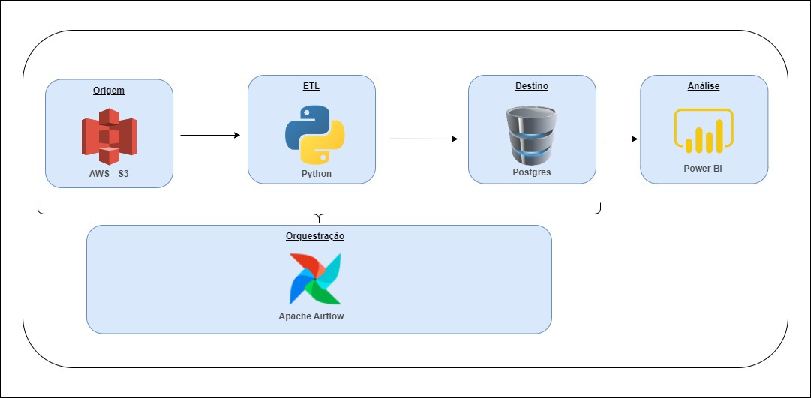
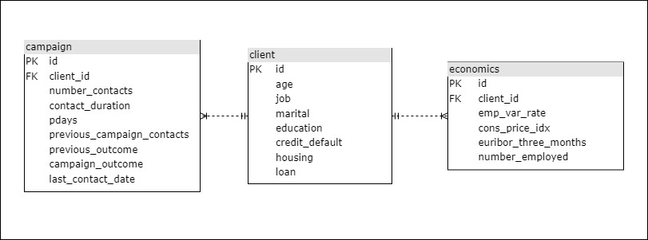

# Campanha de Marketing

## Índice

- [Sobre](#sobre)
- [Modelo de Negócio](#md_negocio)
- [Pipeline de Dados](#pipeline)
- [Como Rodar o Projeto](#run)

<br>

## Sobre <a name = "sobre"></a>

Esse projeto tem como objetivo criar caso de uso de uma pipeline de dados simples que utilize as ferramentas AWS, Terraform, Python, Airflow, Postgres e Power BI.

<br>

## Modelo de Negócio <a name = "md_negocio"></a>

Você foi solicitado a trabalhar em colaboração com um banco a fim de limpar e armazenar os dados coletados como parte de uma recente campanha de marketing que visava incentivar os clientes a contratar um empréstimo pessoal. Como a instituição bancária planeja realizar futuras campanhas de marketing, sua tarefa é criar uma série de etapas para o processamento e armazenamento de dados, projetando o esquema de forma a permitir que os dados de campanhas futuras sejam facilmente importados.

<br>

## Pipeline de Dados <a name = "pipeline"></a>

Após reuniões com os stakeholders, chegou-se no seguinte pipeline de dados:
<br>

<br>


### Origem

Os dados de origem estão localizados em um bucket do Amazon S3. Periodicamente é feito um upload de dados no formato CSV para o bucket.

### Orquestração

Para a orquestração do pipeline de dados é utilizada ferramenta Apache Airflow. Foi definido junto aos stakeholders que o pipeline ETL executa todo sábado as 22 horas.

### ETL

O pipeline ETL utiliza a linguagem Python para a extração dos dados da origem, então os dados passam por uma limpeza e normalização, por fim, são armazenados no banco de dados de destino. 

### Destino

Após os dados serem transformados, são enviados para um banco de dados on-premise, o SGBD escolhido é o Postgres. Após uma analise na estrutura de colunas dos arquivos CSV e consultas com os stakeholders, chegou-se no seguinte modelo lógico para a definição das entidades, relacionamentos e atributos.
<br>

<br>
 
### Análise

A ferramenta que os analistas da empresa utilizam se chama Microsoft Power BI, é um serviço de análise de negócios e analise de dados da Microsoft.

<br>

## Como Rodar o Projeto <a name = "run"></a>

<!-- ```
Give examples
```  -->