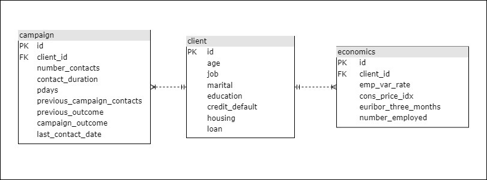

# Campanha de Marketing

## Índice

- [Sobre](#sobre)
- [Modelo de Negócio](#md_negocio)
- [Pipeline de Dados](#pipeline)
- [Como Rodar o Projeto](#run)

<br>

## Sobre <a name = "sobre"></a>

Esse projeto tem como objetivo criar caso de uso de uma pipeline de dados simples que utilize as ferramentas AWS, Terraform, Python, Airflow, Postgres e Power BI.

<br>

## Modelo de Negócio <a name = "md_negocio"></a>

Você foi solicitado a trabalhar em colaboração com um banco a fim de limpar e armazenar os dados coletados como parte de uma recente campanha de marketing que visava incentivar os clientes a contratar um empréstimo pessoal. Como a instituição bancária planeja realizar futuras campanhas de marketing, sua tarefa é criar uma série de etapas para o processamento e armazenamento de dados, projetando o esquema de forma a permitir que os dados de campanhas futuras sejam facilmente importados.

<br>

## Pipeline de Dados <a name = "pipeline"></a>

Após reuniões com os stakeholders, chegou-se no seguinte pipeline de dados:
<br>

<br>


### Origem

Os dados de origem estão localizados em um bucket do Amazon S3. Periodicamente é feito um upload de dados no formato CSV para o bucket.

### Orquestração

Para a orquestração do pipeline de dados é utilizada ferramenta Apache Airflow. Foi definido junto aos stakeholders que o pipeline ETL executa todo sábado as 22 horas.

### ETL

O pipeline ETL utiliza a linguagem Python para a extração dos dados da origem, então os dados passam por uma limpeza e normalização, por fim, são armazenados no banco de dados de destino. 

### Destino

Após os dados serem transformados, são enviados para um banco de dados on-premise, o SGBD escolhido é o Postgres. Após uma analise na estrutura de colunas dos arquivos CSV e consultas com os stakeholders, chegou-se no seguinte modelo lógico para a definição das entidades, relacionamentos e atributos.
<br>

<br>
 
### Análise

A ferramenta que os analistas da empresa utilizam se chama Microsoft Power BI, é um serviço de análise de negócios e analise de dados da Microsoft.

<br>

## Como Rodar o Projeto <a name = "run"></a>

### Requisitos
 - <a href="https://aws.amazon.com/pt/free/?trk=16c88e2f-f4a2-4df9-a8da-5cec9a840180&sc_channel=ps&ef_id=Cj0KCQjwy9-kBhCHARIsAHpBjHgoBuCsAGz5KbOD-mBqkU-pjhss27HIyogO5NptoI4K8hKOtHVkpkMaAms4EALw_wcB:G:s&s_kwcid=AL!4422!3!659757281492!e!!g!!conta%20da%20aws!20187397673!152493143234&all-free-tier.sort-by=item.additionalFields.SortRank&all-free-tier.sort-order=asc&awsf.Free%20Tier%20Types=*all&awsf.Free%20Tier%20Categories=*all">Conta AWS</a>
  - <a href="https://developer.hashicorp.com/terraform/downloads?product_intent=terraform">Terraform</a>
  - <a href="https://www.postgresql.org/download/">Postgres</a>
  - <a href="https://airflow.apache.org/">Airflow</a>
- <a href="https://powerbi.microsoft.com/pt-br/landing/free-account/?ef_id=_k_Cj0KCQjwy9-kBhCHARIsAHpBjHgXvtqDiWjvWJn-ef6tK6aXC7WwkVPw8FhtNFNEr-rM4M2ZU9wLwWQaApLhEALw_wcB_k_&OCID=AIDcmmk4cy2ahx_SEM__k_Cj0KCQjwy9-kBhCHARIsAHpBjHgXvtqDiWjvWJn-ef6tK6aXC7WwkVPw8FhtNFNEr-rM4M2ZU9wLwWQaApLhEALw_wcB_k_&gclid=Cj0KCQjwy9-kBhCHARIsAHpBjHgXvtqDiWjvWJn-ef6tK6aXC7WwkVPw8FhtNFNEr-rM4M2ZU9wLwWQaApLhEALw_wcB">Power BI</a>

Crie <a href="https://docs.aws.amazon.com/pt_br/toolkit-for-visual-studio/latest/user-guide/keys-profiles-credentials.html">Chaves de Acesso </a> para sua conta AWS, com as credenciais em mãos, crie variaveis de ambiente temporarias com as informações adquiridas:
#### WINDOWS ( PowerShell )
```
$env:AWS_ACCESS_KEY_ID="minhachavedeacesso"
$env:AWS_SECRET_ACCESS_KEY="minhachavesecreta"
```

#### LINUX / MAC
```
export AWS_ACCESS_KEY_ID=minhachavedeacesso
export AWS_SECRET_ACCESS_KEY=minhachavesecreta
```

<br>

Com o Terraform instalado, na pasta chamada "terraform" do projeto execute no terminal o comando: 
```
terraform init
```
Esse comando inicializar diretório de trabalho que contem arquivos de configuração do Terraform.

<br>

Em seguida, para provisionar a infraestrutura necessária para o projeto, execute o comando:
```
terraform apply
```
